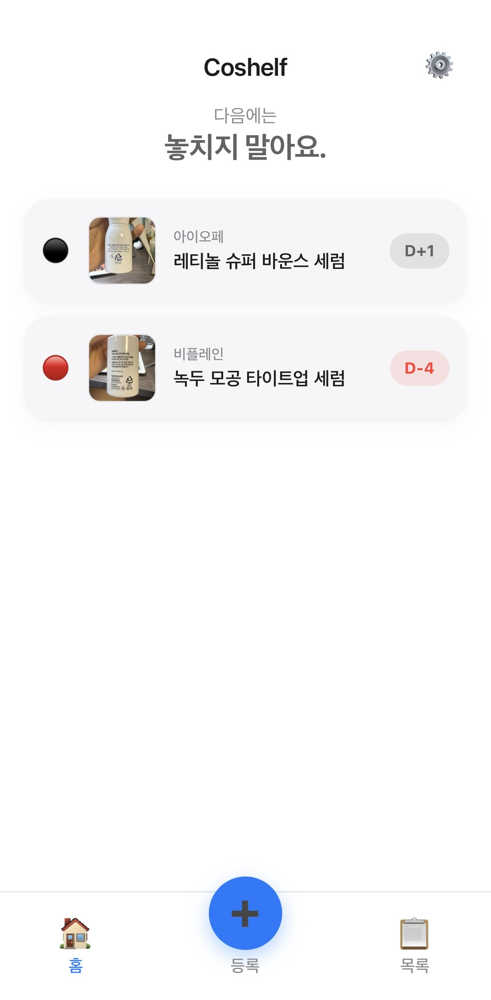
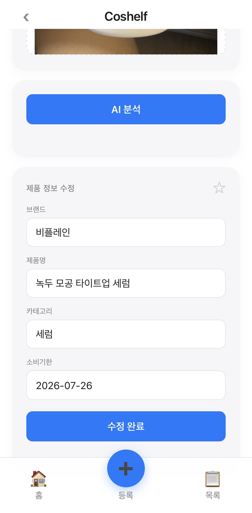
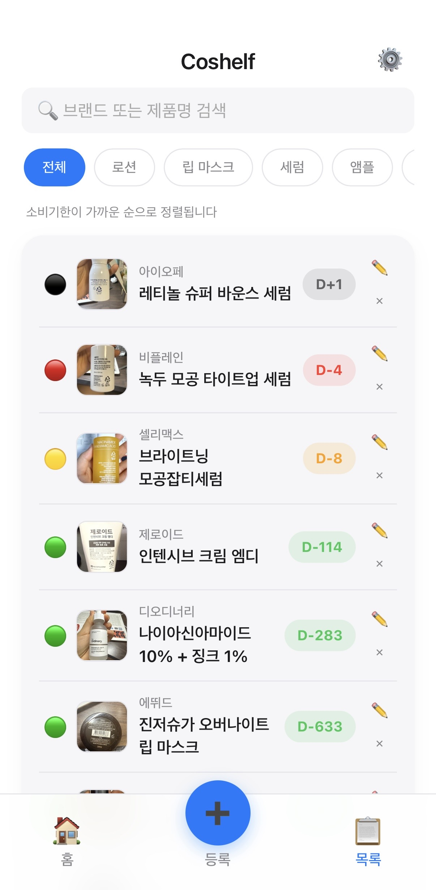
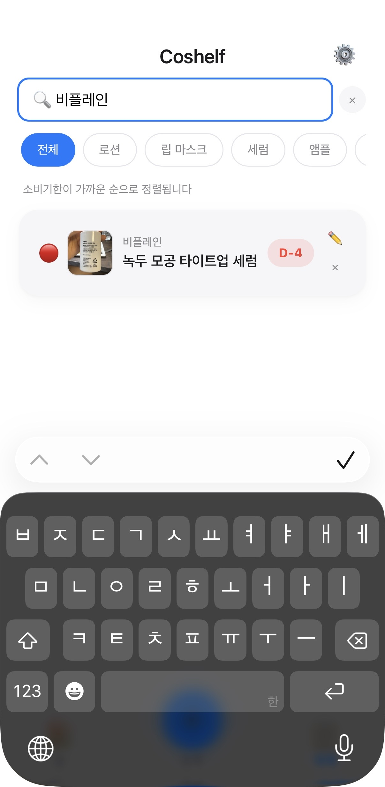
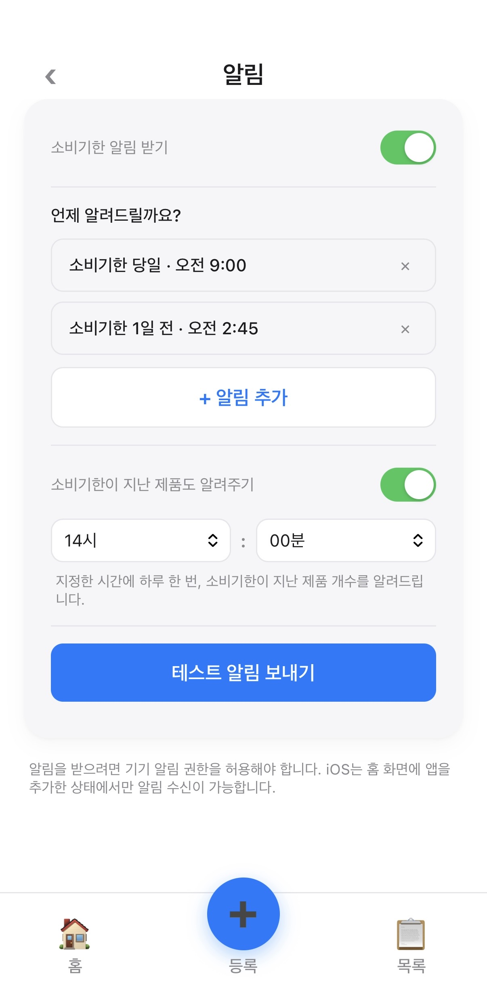
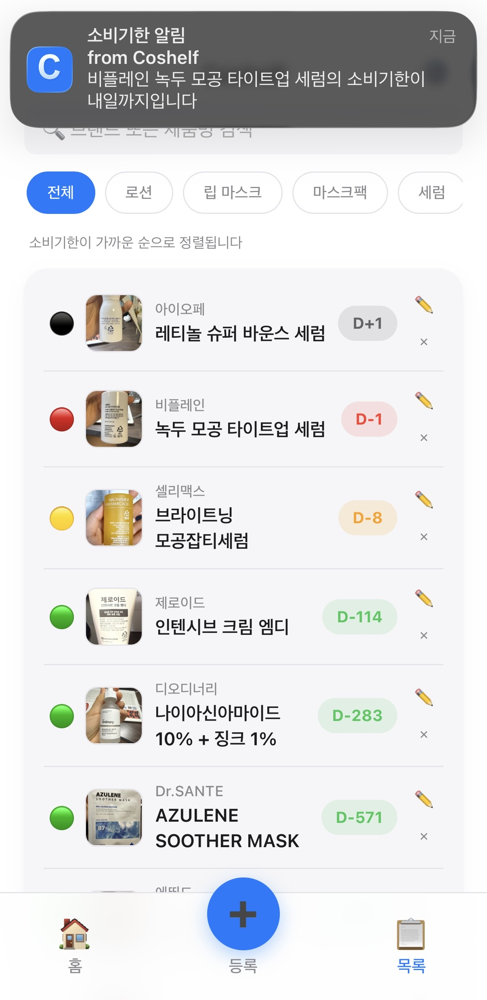

# Coshelf

> 📷 사진 한 장으로 등록하고, 화장품을 끝까지 사용하세요.

Coshelf는 AI를 활용해 화장품의 소비기한을 쉽고 편하게 관리할 수 있는 PWA(Web App)입니다.

사진 한 장만 촬영하면 AI가 브랜드와 제품명을 인식하여 등록을 도와주고, 소비기한이 다가오면 알림을 보내 잊지 않고 사용할 수 있도록 도와줍니다.

🔗 **Live Demo**

https://poohjungmin.github.io/coshelf3/

---

# 📱 스크린샷

### 메인 / 등록

  
  

### 목록 / 검색

  
  

### 알림

  
  

---

# ✨ 주요 기능

- 📷 AI 사진 인식을 통한 제품 등록
- 🧴 브랜드 및 제품명 자동 인식
- 📅 소비기한 관리 및 D-Day 표시
- 🔔 소비기한 알림
- ⭐ 즐겨찾기
- 🔍 제품 검색
- ☁️ Firebase 기반 클라우드 동기화
- 📱 PWA 지원 (홈 화면 설치)

---

# 🛠 기술 스택

### Frontend
- HTML
- CSS
- JavaScript

### Backend
- Firebase Authentication
- Cloud Firestore
- Firebase Cloud Messaging (FCM)

### AI
- Gemini API

### Deployment
- GitHub Pages

---

# 🚀 개발 배경

올리브영 세일이나 행사 기간에 화장품을 여러 개 구매하지만, 사용 중인 제품이 많아 소비기한을 놓치고 버리는 경우가 자주 있었습니다.

기존의 메모나 캘린더 앱은 제품을 하나씩 직접 입력해야 해 번거롭고 꾸준히 사용하기 어려웠습니다.

이러한 불편함을 해결하기 위해 사진 한 장만으로 제품을 등록하고, 소비기한을 관리할 수 있는 서비스를 직접 기획하고 개발했습니다.

---

# 📌 구현 내용

- Gemini API를 활용한 제품 정보 인식
- 소비기한 자동 계산
- Firebase Authentication 로그인
- Cloud Firestore 데이터 동기화
- 웹 푸시 알림(FCM)
- Service Worker 기반 PWA
- 반응형 UI 구현

---

# 👨‍💻 Developer

정민 허

GitHub  
https://github.com/poohjungmin
